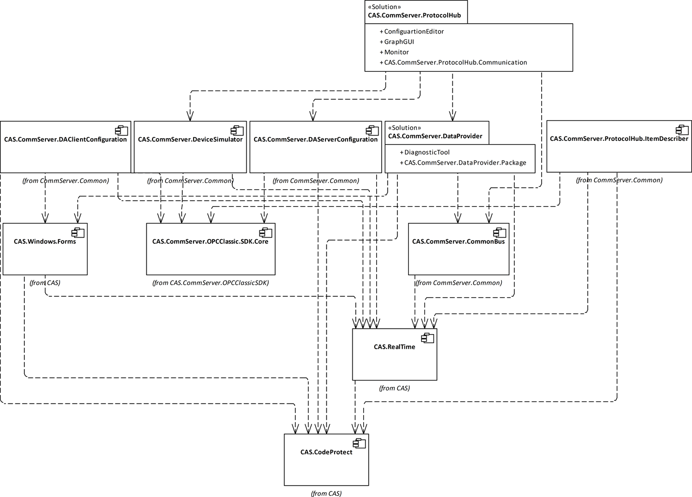

# Process-Observer Common

Contains common projects for [Process-Observer implementation](https://github.com/mpostol/ProcessObserver)

Id | Title
---|-
`CAS.CommServer.DA.ItemDescriberEditor` | Item Describer Editor
`CAS.CommServer.DA.ItemDescriber` | Item Describer Library
`CAS.CommServer.DeviceSimulator` | Device Simulator for CommServer family
`CAS.CommServer.DAServerConfiguration` | CAS.CommServer.ProtocolHub configuration
`CAS.CommServer.DAClientConfiguration` | OPC Classic Client Configuration Library
`CAS.CommServer.CommonBus` | CAS CommServer Family Common Communication Functionality

## ARchitecture

